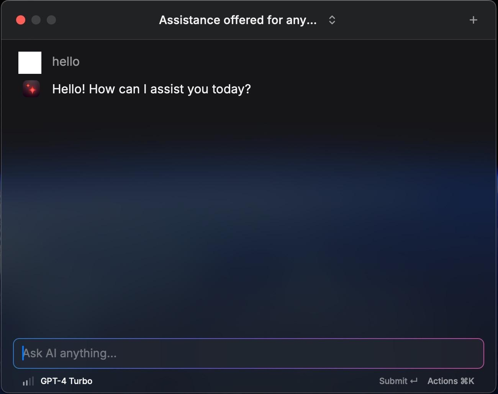
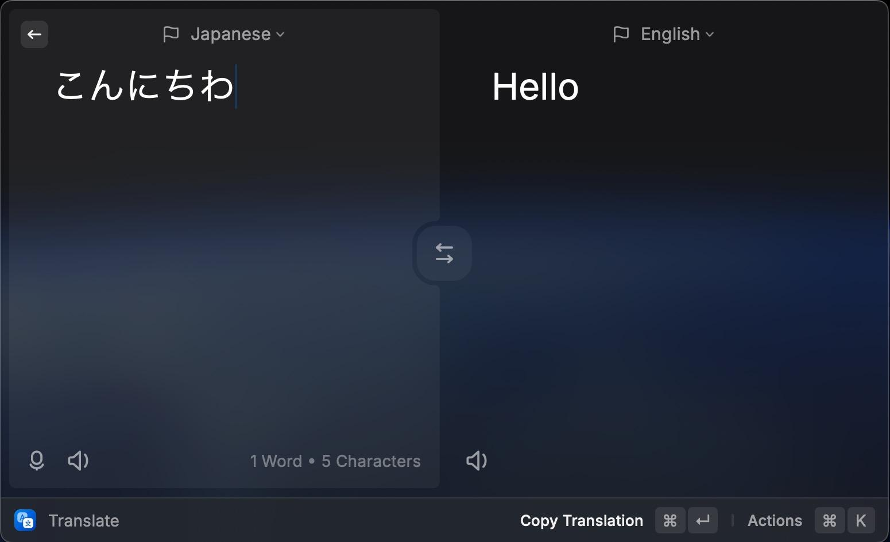

# Raycast AI Proxy

This is a simple [Raycast AI](https://raycast.com/) API proxy. It allows you to use the [Raycast AI](https://raycast.com/ai) application without subscribing. The proxy converts requests
from Raycast into a format to send to the OpenAI API, and then converts the responses back into Raycast’s format.

[English](README.md) | [中文](README.zh.md) | [日本語](README.ja.md)

## Introduction

This project uses a man-in-the-middle approach to forward Raycast requests to the OpenAI API, and then forward the OpenAI responses back to Raycast.

The project mainly maps the following interfaces:

- `GET /api/v1/me` Modifies the flag indicating user support for AI functionality
- `POST /api/v1/translations` Translation interface
- `POST /api/v1/ai/chat_completions` Common AI interface
- `GET /api/v1/ai/models` AI model list interface

The simple principle of the man-in-the-middle proxy is to modify the DNS to direct Raycast’s request IP to the project’s address. The project then forwards the requests to the OpenAI API
and returns the responses after converting them. However, since Raycast and the Raycast API use HTTPS, the project needs to provide a self-signed certificate and make Raycast trust this
certificate. For more details on man-in-the-middle proxies, you can refer to (<https://docs.mitmproxy.org/stable/concepts-howmitmproxyworks/>).

### Supported Models
>
> Multiple models can be used simultaneously by setting the corresponding environment variables.

| Model Provider | Models | Test Status | Environment Variables | Image generation |
| --- | --- | --- | --- | --- |
| `openai` | gpt-3.5-turbo, gpt-4-turbo, gpt-4o | Tested | `OPENAI_API_KEY` | Supported |
| `azure openai` | Same as above | Tested | `AZURE_OPENAI_API_KEY`, `AZURE_DEPLOYMENT_ID`, `OPENAI_AZURE_ENDPOINT` | Supported |
| `google` | gemini-pro, gemini-1.5-pro | Tested | `GOOGLE_API_KEY` | x |

### Ai chat



### Translate



### Image Generation

Only OpenAI API supports image generation.

## Usage

### Installation and Configuration

#### 1. Generate Certificate

```sh
pip3 install mitmproxy
python -c "$(curl -fsSL https://raw.githubusercontent.com/yufeikang/raycast_api_proxy/main/scripts/cert_gen.py)"  --domain backend.raycast.com  --out ./cert
```

Or

Clone this repository and run:

```sh
pdm run cert_gen
```

#### 2. Add Certificate to System Keychain

Open the CA certificate in the `cert` folder and add it to the system keychain and trust it.
This is **mandatory**, as the Raycast AI proxy uses a self-signed certificate, and it must be trusted to work correctly.

Note:

When using on macOS with Apple Silicon, if you encounter application hanging issues when manually adding the CA certificate to the "Keychain Access", you can use the following command in
the terminal as an alternative:

(<https://docs.mitmproxy.org/stable/concepts-certificates/#installing-the-mitmproxy-ca-certificate-manually>)

```shell
sudo security add-trusted-cert -d -p ssl -p basic -k /Library/Keychains/System.keychain ~/.mitmproxy/mitmproxy-ca-cert.pem
```

#### 3. Modify `/etc/host` to add the following lines

```
127.0.0.1 backend.raycast.com
::1 backend.raycast.com
```

The purpose of this modification is to redirect `backend.raycast.com` to the local machine, rather than the real `backend.raycast.com`. You can also add this record in your DNS server.

Alternatively, you can add this record to your DNS server. The ultimate goal is to make `backend.raycast.com` point to the address where this project is deployed. The `127.0.0.1` can be
replaced with your deployment address. If you deploy this project in the cloud or in your local network, you can point this address to your deployment address.

#### 4. Launch the service

```sh
docker run --name raycast \
    -e OPENAI_API_KEY=$OPENAI_API_KEY \
    -p 443:443 \
    --dns 1.1.1.1 \
    -v $PWD/cert/:/data/cert \
    -e CERT_FILE=/data/cert/backend.raycast.com.cert.pem \
    -e CERT_KEY=/data/cert/backend.raycast.com.key.pem \
    -e LOG_LEVEL=INFO \
    -d \
    ghcr.io/yufeikang/raycast_api_proxy:main
```

You can also deploy this service in the cloud or your local network, as long as your Raycast can access this address.

**Then, restart Raycast, and you should be able to use it.**

### Advanced Configuration

#### 1. Using Azure OpenAI API

Refer to [How to switch between OpenAI and Azure OpenAI endpoints with Python](https://learn.microsoft.com/en-us/azure/ai-services/openai/how-to/switching-endpoints).

Simply modify the corresponding environment variables.

```sh
docker run --name raycast \
    -e OPENAI_API_KEY=$OPENAI_API_KEY \
    -e OPENAI_API_BASE=https://your-resource.openai.azure.com \
    -e OPENAI_API_VERSION=2023-05-15 \
    -e OPENAI_API_TYPE=azure \
    -e AZURE_DEPLOYMENT_ID=your-deployment-id \
    -p 443:443 \
    --dns 1.1.1.1 \
    -v $PWD/cert/:/data/cert \
    -e CERT_FILE=/data/cert/backend.raycast.com.cert.pem \
    -e CERT_KEY=/data/cert/backend.raycast.com.key.pem \
    -e LOG_LEVEL=INFO \
    -d \
    ghcr.io/yufeikang/raycast_api_proxy:main
```

#### 2. Google Gemini API

> Can be used together with the OpenAI API by setting the corresponding environment variables.

Obtain your [Google API Key](https://makersuite.google.com/app/apikey) and export it as `GOOGLE_API_KEY`.

```sh
# git clone this repo and cd to it
docker build -t raycast .
docker run --name raycast \
    -e GOOGLE_API_KEY=$GOOGLE_API_KEY \
    -p 443:443 \
    --dns 1.1.1.1 \
    -v $PWD/cert/:/data/cert \
    -e CERT_FILE=/data/cert/backend.raycast.com.cert.pem \
    -e CERT_KEY=/data/cert/backend.raycast.com.key.pem \
    -e LOG_LEVEL=INFO \
    -d \
    raycast:latest
```

#### 3. Local Manual Run

1. Clone this repository
2. Install dependencies using `pdm install`
3. Create environment variables

```
export OPENAI_API_KEY=<your openai api key>
```

4. Generate self-signed certificate using `./scripts/cert_gen.py --domain backend.raycast.com  --out ./cert`
5. Start the service using `python ./app/main.py`

#### 4. Local Development

Since you might have modified the local DNS, developing locally might lead to DNS loops. To avoid this, use Docker during local development and start the development environment by
specifying the DNS.

Reference:

```sh
sh ./local_docker.sh
```

#### 5. Using Custom Mapping

You can refer to the `custom_mapping.yml.example` file in the project directory to customize the modifications to some interface responses.

```yaml
"api/v1/me/trial_status":
  get:
    response:
      body:
        # json path replace
        "$.trial_limits.commands_limit": 30
```

For example, the above configuration will replace `$.trial_limits.commands_limit` in the response body of the `GET api/v1/me/trial_status` interface with `30`. The
`$.trial_limits.commands_limit` is a [JSON path](https://goessner.net/articles/JsonPath/).

Currently, only response body replacements are supported.

#### 6. Multi-User Shared Service

If you want to allow multiple users to share this service or you deploy the service on the public internet, you need to restrict which users can access the service. You can use the
`ALLOWED_USERS` environment variable to restrict which users can access the service.

```env
ALLOWED_USERS="xx@example.com,yy@example.com"
```

The email addresses are the Raycast user email addresses, separated by commas.

### Notes

1. DNS Designation
Due to the presence of GFW (Great Firewall of China), if you use this in mainland China, you might need to designate a domestic DNS server. Otherwise, domain names might not resolve
correctly. For instance: `--dns 223.5.5.5`.

2. DNS Not Taking Effect
Sometimes on macOS, modifying the `/etc/hosts` file does not take effect immediately. There’s no known solution to this yet. Sometimes restarting Raycast helps, or modifying the
`/etc/hosts` file again might work.

### Roadmap

- [ ] Support web search
- [ ] Support more AI models
- [ ] Improve project structure
