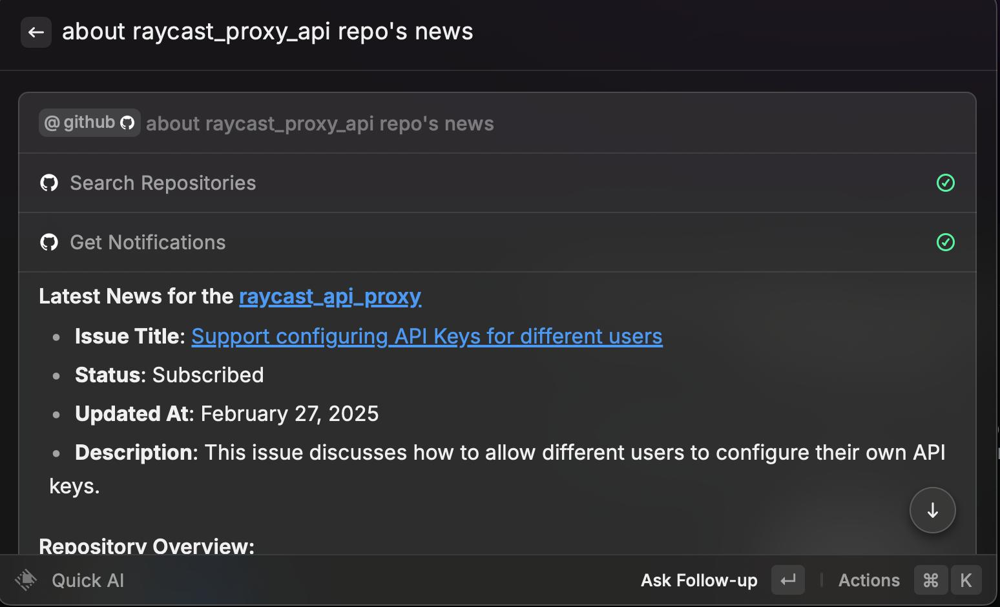

# Raycast AI 代理

这是一个简单的 [Raycast AI](https://raycast.com/)API代理。它允许您在不订阅的情况下使用 [Raycast AI](https://raycast.com/ai)
应用。它是一个简单的代理，将raycast的请求转换格式转发到 OpenAI 的 API，响应后再实时转换格式返回。

[English](README.md) | [中文](README.zh.md) | [日本語](README.ja.md)

## 介绍

本项目是通过使用中间人代理的方式，将raycast的请求转发到OpenAI的API，然后再将OpenAI的响应转发到raycast。

本项目主要mapping了以下几个接口：

- `GET /api/v1/me` 修改用户支持AI功能的flag
- `POST /api/v1/translations` 翻译接口
- `POST /api/v1/ai/chat_completions` AI功能共同接口
- `GET /api/v1/ai/models` AI模型列表接口

中间人代理的简单原理是，通过修改DNS，将raycast的请求的IP指向到本项目的地址，然后本项目再将请求转发到OpenAI的API，然后再将OpenAI的响应转发到raycast。但是raycast和raycast api之间使用的https，所以本项目需要提供自签名证书，并且让raycast信任这个证书。更多关于中间人代理的原理，可以参考[mitmproxy](https://docs.mitmproxy.org/stable/concepts-howmitmproxyworks/)

### AI扩展



### 支持的模型
>
> 多个模型可以同时使用，只需设置相应的环境变量即可

| 模型provider | 模型 | 测试状态 | 图片生成 | Web搜索 | AI扩展 |
| --- | --- | --- | --- | --- | --- |
| `openai` | **from api** | 已测试 | 已支持 | 不支持 | 已支持 |
| `azure openai` | 同上 | 已测试 | 已支持 | 不支持 | 不支持 |
| `google` | **from api** | 已测试 | 不支持 | **from api** | 不支持 |
| `anthropic` | claude-3-sonnet, claude-3-opus, claude-3-5-opus | 已测试 | 不支持 | 不支持 | 不支持 |

#### 支持openai api兼容的provider

##### [Ollama](https://ollama.com/) 示例

添加环境变量

- `OPENAI_PROVIDER=ollama`
- `OPENAI_BASE_URL=http://localhost:11434/v1`
- `OPENAI_API_KEY=ollama` # required, but unused

模型将从`http://localhost:11434/v1/models`获取

### 基于YAML的模型配置

您现在可以通过编辑`config.yml`文件来配置多个模型（例如OpenAI和其他兼容OpenAI提供程序），而不仅仅是使用环境变量。

```yaml
models:
  - provider_name: "openai"
    api_type: "openai"
    params:
      api_key: "sk-xxxx"
      allow_model_patterns:
        - "gpt-\\d+"

  - provider_name: "anthropic"
    api_type: "anthropic"
    params:
      api_key: "sk-ant-xxx"

  - provider_name: "DeepSeek"
    api_type: "deepseek"
    params:
      api_key: "sk-deepseek-xxx"
```

有关更多详细信息，请参考`config.yml.example`文件。

### CLI 命令行使用

当直接运行程序包（不通过 Docker）时，可以使用以下 CLI 选项：

```sh
raycast_proxy run [OPTIONS]

Options:
  --host TEXT      绑定的主机地址 (默认: 0.0.0.0)
  --port INTEGER   绑定的端口 (SSL 启用时默认为 443，未启用时为 80)
  --ssl/--no-ssl  启用 SSL (默认: False)
  --cert-file TEXT SSL 证书文件路径 (如未提供则自动生成)
  --key-file TEXT  SSL 密钥文件路径 (如未提供则自动生成)
  --domain TEXT    SSL 证书的域名 (默认: backend.raycast.com)
  --log-level TEXT 日志级别 (默认: INFO)
```

使用示例：

```sh
# 使用 SSL 和自定义端口运行
raycast_proxy run --ssl --port 8443 --cert-file ./cert/cert.pem --key-file ./cert/key.pem

# 不使用 SSL，在 8080 端口运行
raycast_proxy run --no-ssl --port 8080

# 使用自定义域名和日志级别运行
raycast_proxy run --ssl --domain custom.domain.com --log-level DEBUG
```

### Ai chat


### Translate


### Image Generation

只有OpenAI API支持图片生成。

## 使用方法

### 安装和配置

#### 1. 生成证书

```sh
pip3 install mitmproxy
python -c "$(curl -fsSL https://raw.githubusercontent.com/yufeikang/raycast_api_proxy/main/scripts/cert_gen.py)"  --domain backend.raycast.com  --out ./cert
```

或

clone 本仓库，然后运行

```sh
pip install uv
uv venv
source .venv/bin/activate
uv pip install -e ".[dev]"
python scripts/cert_gen.py --domain backend.raycast.com --out ./cert
```

#### 2. 将证书信任添加到系统钥匙链

打开 `cert` 文件夹中的 ca 证书，并将其添加到系统钥匙链并信任。
这是**必须**的，因为 Raycast AI 代理使用自签名证书，必须信任它才能正常工作。

注意：

在Apple Silicon的macOS上使用时，如果在手动向`钥匙串访问`添加CA证书时遇到应用程序挂起的问题，您可以在终端使用以下命令作为替代方法：

[mitmproxy document](https://docs.mitmproxy.org/stable/concepts-certificates/#installing-the-mitmproxy-ca-certificate-manually)

```shell
sudo security add-trusted-cert -d -p ssl -p basic -k /Library/Keychains/System.keychain ~/.mitmproxy/mitmproxy-ca-cert.pem
```

#### 3. 修改 `/etc/hosts` 以添加以下行

```
127.0.0.1 backend.raycast.com
::1 backend.raycast.com
```

此修改的目的是为了把 `backend.raycast.com` 指定到本地，而不是真正的 `backend.raycast.com`。当然你也可以在你的dns server中添加这个记录。

当然，这里你也可以在你自己的dns server中添加这个记录。其终极目的是让 `backend.raycast.com` 指向到本项目的部署地址。 这里的127.0.0.1也可以替换为你的部署地址。如果你把这个项目部署到了云上，或者你的局域网中，你可以把这个地址指向到你的部署地址。

#### 4. 启动服务

```sh
docker run --name raycast \
    -e OPENAI_API_KEY=$OPENAI_API_KEY \
    -p 443:443 \
    --dns 1.1.1.1 \
    -v $PWD/cert/:/data/cert \
    -e CERT_FILE=/data/cert/backend.raycast.com.cert.pem \
    -e CERT_KEY=/data/cert/backend.raycast.com.key.pem \
    -e LOG_LEVEL=INFO \
    -d \
    ghcr.io/yufeikang/raycast_api_proxy:main
```

你也可以把这个服务部署云服务上，或者局域网中，只要你的raycast可以访问到这个地址即可。

**之后，重启 Raycast，然后就可以使用了。**

### 高级配置

#### 1. 使用 Azure OpenAI API

参考 [How to switch between OpenAI and Azure OpenAI endpoints with Python](https://learn.microsoft.com/en-us/azure/ai-services/openai/how-to/switching-endpoints)

只需要修改相应的环境变量即可。

```sh
docker run --name raycast \
    -e OPENAI_API_KEY=$OPENAI_API_KEY \
    -e OPENAI_BASE_URL=https://your-resource.openai.azure.com \
    -e OPENAI_API_VERSION=2023-05-15 \
    -e OPENAI_API_TYPE=azure \
    -e AZURE_DEPLOYMENT_ID=your-deployment-id \
    -p 443:443 \
    --dns 1.1.1.1 \
    -v $PWD/cert/:/data/cert \
    -e CERT_FILE=/data/cert/backend.raycast.com.cert.pem \
    -e CERT_KEY=/data/cert/backend.raycast.com.key.pem \
    -e LOG_LEVEL=INFO \
    -d \
    ghcr.io/yufeikang/raycast_api_proxy:main
```

#### 2. Google Gemini API

> 可同时和 OpenAI API 一起使用，只需设置相应的环境变量即可

获取你的 [Google API Key](https://makersuite.google.com/app/apikey) 然后 export 为 `GOOGLE_API_KEY`.

```sh
# git clone this repo and cd to it
docker build -t raycast .
docker run --name raycast \
    -e GOOGLE_API_KEY=$GOOGLE_API_KEY \
    -p 443:443 \
    --dns 1.1.1.1 \
    -v $PWD/cert/:/data/cert \
    -e CERT_FILE=/data/cert/backend.raycast.com.cert.pem \
    -e CERT_KEY=/data/cert/backend.raycast.com.key.pem \
    -e LOG_LEVEL=INFO \
    -d \
    raycast:latest
```

#### 3. 本地手动运行

1. clone 本仓库
2. 安装依赖项:

```sh
pip install uv
uv venv
source .venv/bin/activate
uv pip install -e ".[dev]"
```

3. 创建环境变量：

```sh
export OPENAI_API_KEY=<your openai api key>
```

4. 生成自签名证书：

```sh
python scripts/cert_gen.py --domain backend.raycast.com --out ./cert
```

5. 启动服务：

```sh
python ./app/main.py
```

#### 4. 本地开发

因为你可能修改了本级的DNS，所以你在本地开发的时候，很可能导致DNS死循环。所以你可以在本地开发的时候，可以使用docker。然后通过指定dns的方式启动开发环境。

参考：

```sh
sh ./local_docker.sh
```

#### 5. 使用custom mapping

你可以参考项目目录中的`custom_mapping.yml.example`文件，自定义修改一些接口的返回值。

```yaml
"api/v1/me/trial_status":
  get:
    response:
      body:
        # json path replace
        "$.trial_limits.commands_limit": 30
```

例如上面的配置，将会把 `GET api/v1/me/trial_status` 接口的返回值中的 `$.trial_limits.commands_limit` 替换为 `30`。 其中 `$.trial_limits.commands_limit` 是一个 [json path](https://goessner.net/articles/JsonPath/)。

目前只支持response body的替换。

#### 6. 多用户共享服务

如果你想要多个用户共享这个服务，或者你把服务部署在公网上，你需要限制哪些用户可以使用这个服务。你可以使用`ALLOWED_USERS`环境变量来限制哪些用户可以使用这个服务。

```env
ALLOWED_USERS="xx@example.com,yy@example.com"
```

email地址是raycast的用户email地址，多个用户之间用逗号分隔。

### 注意事项

1. DNS指定
由于GFW的存在，如果你在中国大陆使用，你可能需要指定一个国内的DNS服务器，否则可能会出现无法解析域名的情况。
如： `--dns 223.5.5.5`

2. DNS不生效
macOS上有时候会出现修改了`/etc/hosts`文件，但是DNS不生效的情况，目前没有找到解决办法，有时候重启raycast可以生效，有时候再次修改`/etc/hosts`文件可以生效。
